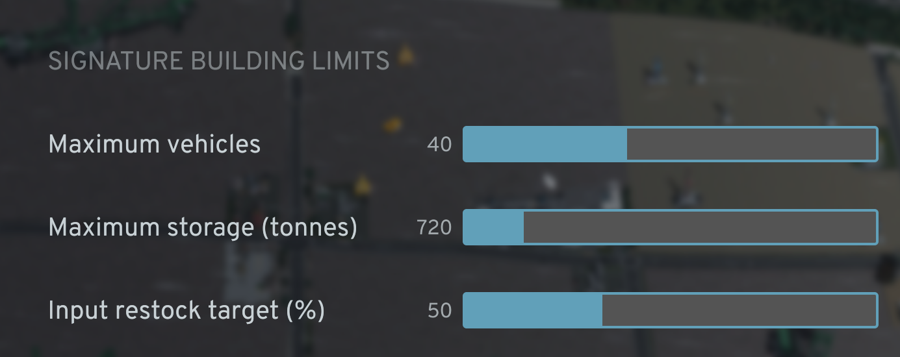

# Signature Logistics

A Cities: Skylines II code/UI mod that lets you choose the vehicle and storage limits for signature buildings, keep their production inputs stocked, and inspect active deliveries.

[Download on Paradox Mods](https://mods.paradoxplaza.com/mods/151747/Windows)



## Usage

Open **Options > Signature Logistics** and configure:

- **Maximum vehicles**: 1-100, default 20.
- **Maximum storage (tonnes)**: 10-5,000 t, default 500 t.
- **Input restock target**: 25-100%, default 25%.

Changes save automatically, load on the next game start, and act as the defaults for existing signature buildings and buildings placed later.

To customize one building, select a signature factory. The **Signature building limits** controls appear immediately above **Vehicles in use** and save a vehicle and storage override on that building in the current city. **Use global defaults** removes the override and returns that building to the Options values.

When a required production input plus deliveries already on the way falls below the restock target, the mod asks the game's normal purchase system for another truckload. The game still uses real local suppliers or outside connections, pays normal costs, and requires a working delivery route.

Only signature-building companies are changed. Service vehicle capacities, ordinary zoned companies, and cargo stations are left untouched. Signature factories are unique buildings; their dedicated company prefab consumes the saved building-specific limits.

Expand **Vehicles in use** on a building to see each delivery vehicle's current cargo/capacity and approximate straight-line distance to its current destination on the same row. The game's original state link remains clickable.

## Build

Install and initialize the Cities: Skylines II modding toolchain in-game, then build `Fix-Signatures.slnx` with Visual Studio or `dotnet build`.

The project also accepts the toolchain path as an MSBuild override:

```powershell
dotnet build Fix-Signatures.slnx --configfile NuGet.Config -p:CSIIToolPath="C:\path\to\.ModdingToolchain"
```

Build the UI module separately with the official template's pinned tooling:

```powershell
cd Fix-Signatures.UI
npm install
npm run build
```

For the pinned, isolated check used by this repository:

```powershell
docker build -t fix-signatures-ui Fix-Signatures.UI
```

## Publish to Paradox Mods

The store metadata is in `Fix-Signatures/Properties/PublishConfiguration.xml`. Paradox Mods ID `151747` targets game version `1.6.0*`, uses version `1.0.1`, and has no mod or DLC dependencies.

1. Run the UI test/build first: `npm test` in `Fix-Signatures.UI` (or use the Docker command above).
2. For later releases, increment `ModVersion`, update `ChangeLog`, and publish the managed project with the `PublishNewVersion` profile in Visual Studio. The Release build refuses to package without the UI bundle and includes the `.mjs` and `.css` beside the DLL automatically.

Publishing is the only step that signs in to Paradox Mods or changes the remote listing; normal builds do not upload anything.

For a local installation, place `Fix-Signatures.dll`, `Fix-Signatures.mjs`, and `Fix-Signatures.css` together in the game's `Mods\Fix-Signatures` folder. The current game UI loader discovers ES modules by the `.mjs` extension.
