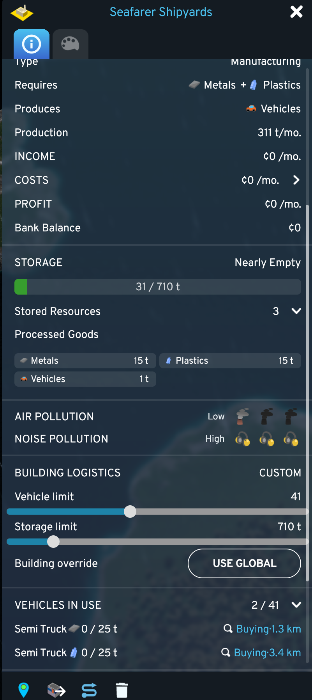

# Signature Logistics

A Cities: Skylines II code/UI mod that lets you choose the vehicle and storage limits for signature buildings, keep their production inputs stocked, and inspect active deliveries.

[Download on Paradox Mods](https://mods.paradoxplaza.com/mods/151747/Windows)

[Discuss the mod and leave feedback on the Paradox forum](https://forum.paradoxplaza.com/forum/threads/mod-signature-logistics-configurable-vehicles-storage-imports-and-company-stability.1935899/)



## Usage

Open **Options > Signature Logistics** and configure:

- **Maximum vehicles**: 1-100, default 20.
- **Maximum storage (tonnes)**: 10-5,000 t, default 500 t.
- **Input restock target**: 25-100%, default 25%.

Changes save automatically, load on the next game start, and act as the defaults for existing signature buildings and buildings placed later.

To customize one building, select a signature factory. The **Building logistics** controls appear immediately above **Vehicles in use** and save a vehicle and storage override on that building in the current city. **Use global** removes the override and returns that building to the Options values.

When a required production input plus deliveries already on the way falls below the restock target, the mod asks the game's normal purchase system for another truckload. Inputs are compared by recipe-weighted production coverage rather than raw tonnes, so the material that will stop production first is restocked first. Empty outbound buying trucks reserve their full capacity until they load, preventing the mod from repeatedly ordering against the same apparent deficit. Priority restocking uses outside connections for dependable stock, requests one full largest-compatible truck, and only falls back as far as 75% when storage headroom or the bankruptcy cushion requires it; requests below that threshold wait instead of intentionally sending a nearly empty vehicle. The game still uses normal import costs, vehicles, pathfinding, and working road routes. The game's own ordinary company purchases remain unchanged and can still buy locally.

Signature tenants are also protected from the game's random tax and worker-shortage move-away rolls, which use the same internal marker as bankruptcy and can otherwise replace a company even when it is financially viable. Genuine bankruptcy is still possible when a company remains below the game's bankruptcy threshold for the full grace period.

Each newly observed signature tenant receives a second copy of its non-money starting resources. This doubles the vanilla input and output stacks available immediately after move-in without changing the company's bank balance. Saved tenant history prevents the grant from repeating after save/reload.

The **Company** section on a selected signature factory shows why its previous tenant left. The history saves with the city and reports the strongest active warning observed at bankruptcy: missing materials, no customers, educated-worker shortage, general worker shortage, or other losses. Rent and property-capacity changes that remove the tenant link are recorded as **Relocated: Rent/property change**. A tenant change that bypasses both normal paths is labeled **External/load replacement** because save repair, debug tools, another mod, or a departure from before this version does not leave a reliable cause to reconstruct. Buildings without a recorded change show **No departure recorded**.

Only signature-building companies are changed. Service vehicle capacities, ordinary zoned companies, and cargo stations are left untouched.

Signature factories are unique buildings, but their tenants are not: a signature tenant is an ordinary company using one of the game's shared company prefabs, and the vehicle and storage limits the game reads live on that prefab rather than on the company. Writing them directly would raise the limits for every commercial, office, and industrial company in the city using the same prefab. Instead each signature tenant is given a private copy of its company prefab and only that company is repointed at it, so the saved building-specific limits reach that tenant alone. `NOTES.md` records the read sites this was traced through and the traps involved.

Expand **Vehicles in use** on a building to see each delivery vehicle's current cargo/capacity and approximate straight-line distance to its current destination on the same row. The game's original state link remains clickable.

## Build and deploy locally

Install and initialize the Cities: Skylines II modding toolchain in-game, then build
`Fix-Signatures.slnx` with Visual Studio or `dotnet build`.

Build the UI first. A Release build refuses to package without the bundle, and the toolchain's
`DeployWIP` target clears the deploy directory before copying, so a managed-only build can leave a
fresh `.dll` beside no `.mjs`.

```powershell
cd Fix-Signatures.UI
npm test

cd ..\Fix-Signatures
dotnet build -c Debug
```

`DeployWIP` runs automatically on `AfterBuild` and copies the output to
`%CSII_LOCALMODSPATH%\Fix-Signatures`. Do not invoke it directly with `-t:DeployWIP`: its condition
reads `NeedBuild`, which is only set by `BuildGetFullPaths` during a normal build, so calling the
target alone fails with `MSB4113`.

Verify what landed, then confirm the mod registered — a clean build does not prove it ran:

```powershell
Get-ChildItem "$env:CSII_LOCALMODSPATH\Fix-Signatures"
Get-Content "$env:CSII_USERDATAPATH\Logs\SignatureFix.Mod.log" -Tail 40
```

`Fix-Signatures.dll`, `Fix-Signatures.mjs`, and `Fix-Signatures.css` must all be present.

The project also accepts the toolchain path as an MSBuild override:

```powershell
dotnet build Fix-Signatures.slnx --configfile NuGet.Config -p:CSIIToolPath="C:\path\to\.ModdingToolchain"
```

Build the UI module separately with the official template's pinned tooling:

```powershell
cd Fix-Signatures.UI
npm install
npm run build
```

For the pinned, isolated check used by this repository:

```powershell
docker build -t fix-signatures-ui Fix-Signatures.UI
```

## Publish to Paradox Mods

The store metadata is in `Fix-Signatures/Properties/PublishConfiguration.xml`. Paradox Mods ID `151747` targets game version `1.6.0*`, currently publishes version `1.0.8`, links to the public support forum, and has no mod or DLC dependencies.

See `PUBLISHING.md` for the full procedure and checks. In short: build a clean Release, verify the deploy folder, then call the official publisher directly on that exact folder.

```powershell
cd C:\Users\dkras\source\repos\Fix-Signatures\Fix-Signatures

& "$env:CSII_MODPUBLISHERPATH" NewVersion `
  'Properties\PublishConfiguration.xml' `
  -c "$env:CSII_LOCALMODSPATH\Fix-Signatures" -v
```

Do not use `dotnet publish -p:PublishProfile=...`. The `.pubxml` profiles in `Properties/PublishProfiles` are consumed by the Visual Studio and Rider Publish dialogs; from the command line the profile is not imported, `ModPublisherCommand` stays empty, and the upload never happens. Calling `$env:CSII_MODPUBLISHERPATH` directly also uploads exactly the folder you verified rather than whatever the build last left behind.

The publisher accepts three commands: `Publish` (creates a listing, only while `ModId` is empty), `NewVersion` (new package against an existing listing), and `Update` (metadata only — no package, so it cannot fix a bad build). There is no `New`. `ModId` is already `151747`, so releases use `NewVersion`.

Authentication comes from the publisher's own Paradox session. Never pass credentials on the command line or store them in the repository.

Publishing is the only step that changes the remote listing; normal builds do not upload anything.

For a manual local installation, place `Fix-Signatures.dll`, `Fix-Signatures.mjs`, and `Fix-Signatures.css` together in the game's `Mods\Fix-Signatures` folder. The current game UI loader discovers ES modules by the `.mjs` extension.

## Further reading

- `PUBLISHING.md` — release procedure, verification, and publisher commands.
- `CHANGELOG.md` — full version history.
- `NOTES.md` — findings that cost real debugging time, with citations into the decompiled game source.
